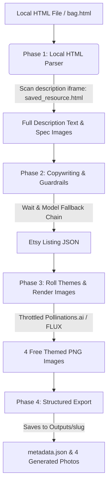

# 🛠️ Etsy Listings Automation Pipeline

An automated pair-programming workspace utility that scrapes product information from AliExpress page source files, generates SEO-optimized Etsy listings using Google Gemini with structured guardrails, and renders themed lifestyle/product images completely for free using the state-of-the-art **FLUX.1-schnell** image model.

---

## 🏗️ Architecture & Pipeline Phases

This automation pipeline runs locally inside a Python virtual environment and is orchestrated by [main.py](file:///c:/Users/Tyrone%20James%20Bacolod/OneDrive/Desktop/All%20Apps/Bacolod%20FIles/PROJECTS/EtsyListingsAutomation/main.py). It operates in 4 distinct phases:



### 1. Phase 1: Smart Data Extraction ([src/scraper.py](file:///c:/Users/Tyrone%20James%20Bacolod/OneDrive/Desktop/All%20Apps/Bacolod%20FIles/PROJECTS/EtsyListingsAutomation/src/scraper.py))
AliExpress actively blocks standard automated headless requests (like live Playwright/requests scrapers) with CAPTCHAs. To bypass this bot-protection, the pipeline parses a saved local HTML file (downloaded as a Complete Webpage in your browser).
*   **Targeted Image Scoping**: Filters out garbage headers, payment/shipping icons, search boxes, and bottom recommendation listings so they don't count towards the image limit.
*   **Description Iframe Parsing**: AliExpress loads the detailed description/sizing charts inside an iframe (saved by browsers in the `bag_files/saved_resource.html` directory). The script automatically detects, opens, and parses this iframe file (if the `_files` folder is copied next to the HTML file) to extract exact dimension specifications.
*   **CDN URL Reconstruction**: Browser saving rewrites image paths to relative local assets. The script uses a regular expression `(S[a-zA-Z0-9]{30,35})` to extract the unique CDN key from the relative filenames and constructs the original high-resolution `https://ae01.alicdn.com/kf/{key}.jpg` URL to download them fresh from the web.

### 2. Phase 2: Copywriting & Guardrails ([src/ai_helper.py](file:///c:/Users/Tyrone%20James%20Bacolod/OneDrive/Desktop/All%20Apps/Bacolod%20FIles/PROJECTS/EtsyListingsAutomation/src/ai_helper.py))
Sends extracted specifications and product photos to Google Gemini to format a professional, structured Etsy listing.
*   **Structured Output (Pydantic Validation)**: Compiles results into a JSON format mapping Title (<= 140 chars), Description, Pricing, and Tags.
*   **Tag Condenser**: Validates that all tags comply with Etsy's strict **20-character limit**. It asks Gemini to intelligently condense keyword phrases exceeding this limit (e.g., `"openwork shoulder bag"` -> `"openwork shoulder"`) instead of plain truncation.
*   **Policy Stretcher**: Automatically appends the shop's Return & Refund policy and Cancellation policies to the bottom of all descriptions.
*   **API Resilience (Model Fallback Chain)**: To stay completely on the **100% Free Tier** without hitting daily limits, the client defaults to `gemini-flash-latest` (1.5 Flash, 1,500 free requests/day) instead of `gemini-2.5-flash` (which is capped at 20 requests/day). 
    *   If a rate limit (429) or server busy error (503) occurs, the script automatically retries with exponential backoff.
    *   If the primary model is unavailable or rate-limited, it automatically falls back in order: `GEMINI_MODEL` -> `gemini-2.5-flash-lite` -> `gemini-flash-lite-latest` -> `gemini-flash-latest`.

### 3. Phase 3: Themed Image Generation ([src/image_gen.py](file:///c:/Users/Tyrone%20James%20Bacolod/OneDrive/Desktop/All%20Apps/Bacolod%20FIles/PROJECTS/EtsyListingsAutomation/src/image_gen.py))
Automatically rolls prompt variations based on your chosen theme in `themes.yaml` (inserting your custom product trigger keywords).
*   **Free Image Rendering (FLUX Model)**: Google AI Studio's Imagen 3 API is disabled on free billing tiers. To provide gorgeous themed photos completely for free, the script integrates **Pollinations.ai** running the state-of-the-art **FLUX.1-schnell** image model.
*   **Request Throttling**: Automatically sleeps for 3 seconds between requests and includes retry logic to avoid rate limits (429) from the free public generation endpoint.
*   **Billing Bypass Toggle**: Set `USE_FREE_GENERATOR=True` in `.env` to default to free FLUX generations, skipping Google Imagen entirely.

### 4. Phase 4: Structured Export
Consolidates the listing data and generated images, exporting them to:
📂 `outputs/{product_slug}/`
*   `metadata.json` (Optimized title, tags, description, price)
*   `1_showcase.png`, `2_worn_or_used.png`, `3_detail_close_up.png`, `4_packaging_or_extra.png`

---

## ⚙️ Setup & Configuration

### Environment Variables (`.env`)
Create a `.env` file in the root directory:
```env
# Your Google Gemini API Key from Google AI Studio
GEMINI_API_KEY=your_gemini_api_key_here

# Enable/Disable the free FLUX image generator fallback (True recommended)
USE_FREE_GENERATOR=True

# Defaults to 1.5 Flash (gemini-flash-latest) to bypass the daily 20-request limit on 2.5
GEMINI_MODEL=gemini-flash-latest
```

---

## 🚀 How to Run the Automation

1.  **Save the AliExpress Product Page**:
    Open the product on your browser, press `Ctrl + S`, select **Webpage, Complete**, and save it (e.g. as `bag.html`).
2.  **Move Files to Workspace**:
    Copy `bag.html` and the corresponding `bag_files/` asset folder into the project root directory. *(Having the `bag_files` folder allows the script to parse specifications from the iframe).*
3.  **Run the script in PowerShell**:
    ```powershell
    .\.venv\Scripts\python main.py --html-file "bag.html" --theme "bauhaus_beige" --product-trigger "nanobananapro2 yarn shoulder bag"
    ```

### Command Arguments:
*   `--html-file`: Path to the saved AliExpress `.html` file.
*   `--theme`: Theme name from `themes.yaml` (e.g. `bauhaus_beige`, `retro_vintage`, `modern_minimalist`).
*   `--product-trigger`: The trigger phrase for the image generation model (e.g. `"nanobananapro2 straw weaving shoulder bag"`).
*   `--inspo-image`: (Optional) Path to a local photo. The script will analyze the photo's backdrop/lighting and use it as a custom generation style instead of a theme.
