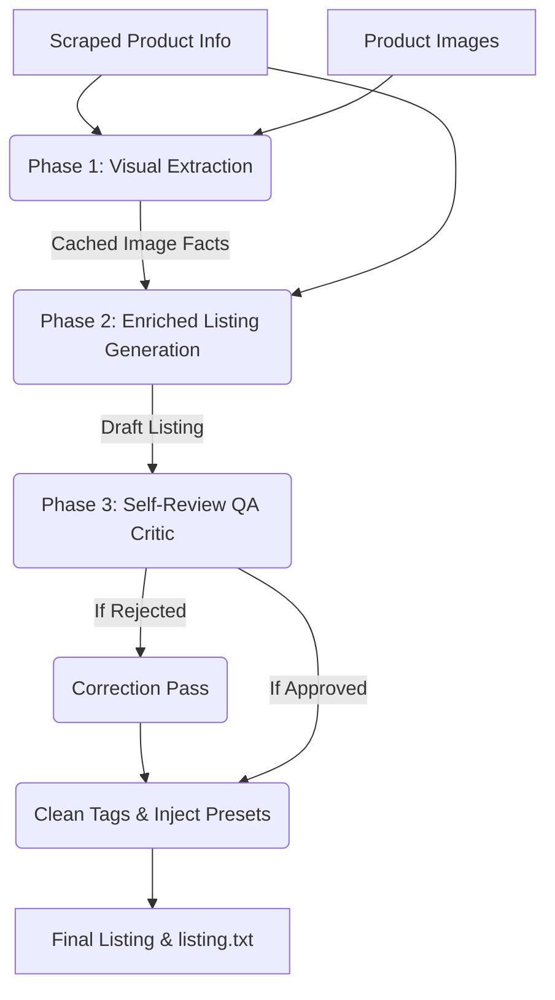

# AI Copywriting Pipeline: Visual Extraction & Self-Review

This document explains the architecture and mechanics of the 3-phase automated copywriting engine implemented in the Etsy Listings Automation tool.

---

## Architecture Overview

Instead of generating listings in a single shot based only on scraped text descriptions, the copywriting engine operates in three distinct phases:



---

## Phase 1: Smart Visual Extraction

AliExpress product details are often incomplete in text form, but contain critical information (like size charts, material labels, or capacity limits) embedded directly in the product photos.

Phase 1 scans a curated batch of downloaded images to build a trusted, structured block of visual specifications.

### Image Selection Logic
To optimize token usage and processing speed while ensuring high accuracy, the system extracts text from a maximum of **11 images**:
1. **Description Images** (up to 6): These are the primary source of detail, usually containing size charts, measurement diagrams, or specification tables.
2. **Main Images** (up to 3): Used to understand the physical design, texture, and visual style.
3. **Variation Images** (up to 2): Used to capture variation colorways.

### Strict Confidence Policy (No Guessing)
The visual extractor adheres to a strict confidence threshold. If a specification is not explicitly printed or clearly visible, it is omitted rather than guessed:
- **Dimensions**: Omitted unless exact measurements (height, width, depth, drop length) are printed.
- **Materials**: Omitted unless material labels (e.g. wool, nylon, stainless steel) are written.
- **Visual Style**: Provides a brief physical description (e.g. "woven texture, hollow-out mesh") to guide the AI writer.

---

## Phase 2: Enriched Copywriting

The facts gathered in Phase 1 are merged with the scraped text from AliExpress and fed to the copywriter model.

The copywriting prompt instructs the model to:
1. **Prioritize Image Facts**: If the scraped text says "Large Size" but the image spec chart states "Width: 38cm, Height: 28cm", the actual dimensions are prioritized.
2. **Eliminate Approximations**: Use the exact measurements from the visual specs. If no dimensions are found, do not hallucinate them.
3. **Structured Outputs**: Formulate title, suggested price, exactly 13 tags, and the main description.

---

## Phase 3: Self-Review QA Critic

To prevent hallucinations, tag overflow, and title issues, the listing passes through an automated review critic.

### Critic Checklist
The reviewer model evaluates the generated draft against the following criteria:
- **Accuracy**: Does the description exactly match the visual facts (dimensions, materials) extracted from Phase 1? Did the copywriter hallucinate any measurements?
- **Title Quality**: Is the title search-optimized, under 140 characters, and incorporating key attributes?
- **Tag Compliance**: Are there exactly 13 tags? Is any tag longer than 20 characters?

### Verdict and Correction
The critic returns a structured response:
```json
{
  "approved": false,
  "title_issues": "",
  "description_issues": "Dimensions from spec sheet (38cm x 28cm) are missing from the description.",
  "tag_issues": "Tag 'large capacity shoulder bags' is 30 characters (limit is 20)."
}
```
- If **Approved**: The listing proceeds directly to saving.
- If **Rejected**: A correction pass is fired. The copywriter receives the draft, the facts, and the critic's specific feedback to rewrite the listing.
- **Max Correction Passes**: Capped at **1 pass** to maintain speed and avoid infinite loops.

---

## Re-Running and Caching

To keep the pipeline fast during re-runs (e.g. if the user changes settings or is unsatisfied with the copywriting), the visual specs are cached:
1. When Phase 1 completes, the extracted facts are saved as `image_facts` inside the product's `metadata.json`.
2. When the pipeline is triggered again for that product, the server checks for the cache. If `image_facts` is present, it **skips the image scanning step** and immediately starts Phase 2.
3. This cuts down the regeneration time to just the writing and review passes (typically under 10 seconds).
